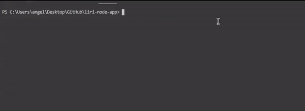

# liri-node-app

## Objective
---
To create a node based language interpretation and recognition interface that can: 
* search for a concert of your favorite artist
* find a song on spotify
* get information about your favorite movie

## Technologies used
---
 * [Node-Spotify-API](https://www.npmjs.com/package/node-spotify-api)
   * To retrieve information about a song from Spotify's API

 * [Axios](https://www.npmjs.com/package/axios)
   * To grab data from the [OMDB API](http://www.omdbapi.com) and the [Bands In Town API](http://www.artists.bandsintown.com/bandsintown-api)

 * [Moment](https://www.npmjs.com/package/moment)
   * To convert the concert dates to a MM-DD-YYYY format

 * [DotEnv](https://www.npmjs.com/package/dotenv)
   * To encapsulate the api keys in an .env file

* [fs](https://nodejs.org/api/fs.html)
  * To log the data returned to an external **log.txt** file

---
### **concert-this**

EXAMPLE:   `node liri.js concert-this <artist/band name here> // API CALL`
 
"https://rest.bandsintown.com/artists/" + artist +
"/events?app_id=codingbootcamp"    
RETURN:

1. Name of venue
2. Venue Location
3. Date of the Event in ("MM/DD/YYYY")

-------
### **spotify-this-song**

EXAMPLE: `node liri.js spotify-this-song "Name of Song"`

RETURN:

1. Artist(s)
2. Name of the Song
3. Preview link of the song from spotify
4. The album that song is from

CONDITIONALS

**if no song entered,default "The Sign" by Ace of Base**

-------------
### **movie-this**

Example `node liri.js movie-this "movie name"`

RETURN

1. Title of the movie
2. Year the movie came out
3. IMDB Rating of the Movie
4. Rotten Tomatoes Ratingb of the Movie
5. Country where the movie was produced
6. Langauge of the movie
7. Plot of the movie
8. Actors in the movie

CONDITIONALS

**If no movie entered, default to "Mr.Nobody"**

-----------

### **do-what-it-says** 
Example: `node liri.js do-what-it-says` 

Description: using the fs node package read what is inside the random.txt file and make the calls that way
